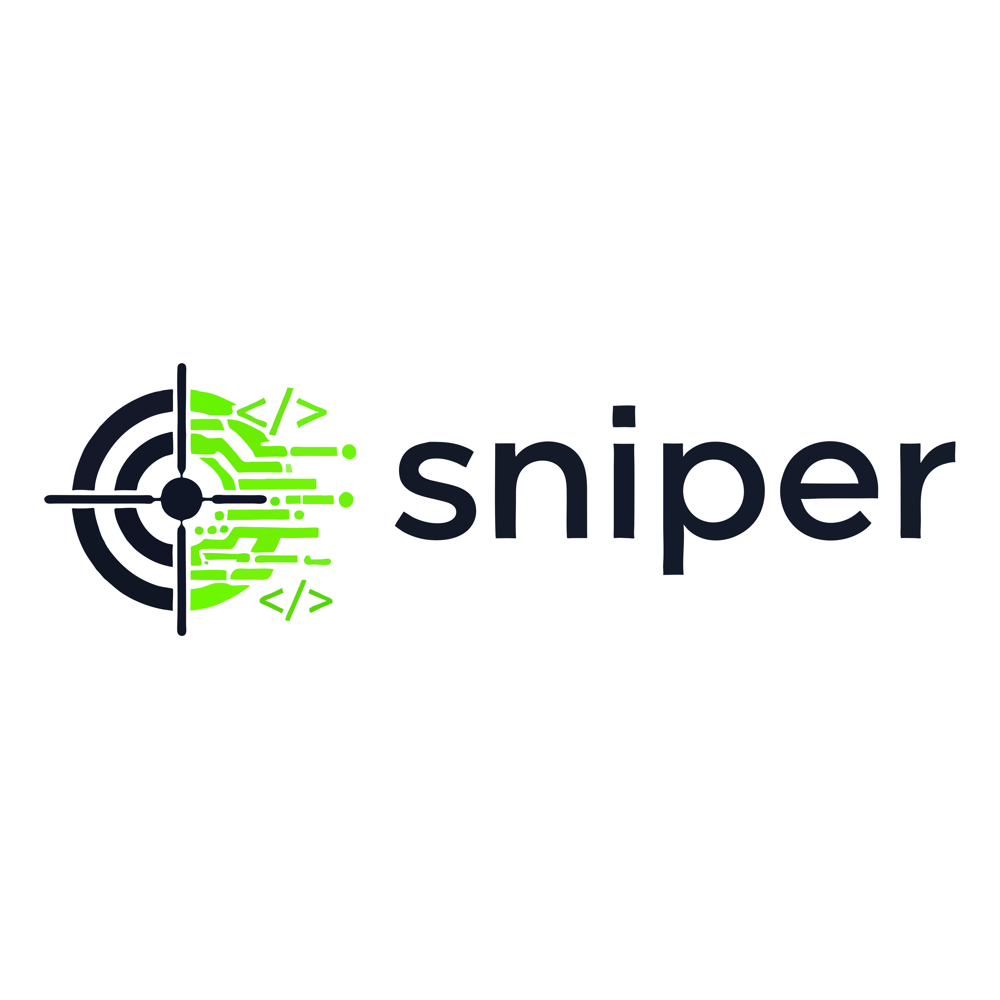

# SNIPER




**Simple Network Input Payload ExploRer**

Owner: https://github.com/zrnge  
Status: Production-ready  
Use case: Authorized HTTP parameter fuzzing and anomaly detection

---

## Overview

**SNIPER** is a lightweight, deterministic HTTP fuzzing tool designed for
**security testing**, **QA**, and **automation pipelines**.

It supports:

- Multi-parameter fuzzing (e.g. `username` + `password`)
- Intruder-style attack modes (Pitchfork / Cluster Bomb)
- Grep-style response filtering (status code, response length)
- CI/CD-friendly output
- Safe throttling and timeout controls

SNIPER focuses on **signal over noise** and is built to scale cleanly in
production environments.

---

## Features

- Multi-parameter fuzzing (any number of parameters)
- Payload iteration modes:
  - **Pitchfork** (parallel iteration)
  - **Cluster Bomb** (Cartesian product)
- Response filtering:
  - HTTP status code matching
  - Response length matching
  - Inverted matching (anomaly detection)
- GET and POST support
- Custom headers (auth tokens, cookies, etc.)
- Deterministic, scriptable output
- No external dependencies beyond `requests`

---

## Installation

### Requirements

- Python 3.8+
- `requests` library

```bash
pip install requests
```

### Clone
```bash
git clone https://github.com/zrnge/sniper.git
cd sniper
```
---
## Basic Usage
```bash
python3 sniper.py --help
```

### SNIPER always requires:
- A target URL
- At least one parameter with a payload file

## Parameters and Payloads

### Single-Parameter Usage (Recommended for Web Testing)
SNIPER fully supports single-parameter fuzzing, making it suitable for classic web testing scenarios such as:
- XSS
- SQLi
- SSTI
- LFI/RFI
- Open redirect testing
Example: Fuzzing a Single Query Parameter
```bash
python3 sniper.py \
  -u https://target/search \
  -X GET \
  --param q=xss.txt
```
This will generate requests equivalent to:
```
https://target/search?q=<payload1>
https://target/search?q=<payload2>
https://target/search?q=<payload3>
...
```

### Remote-payload capable
```bash
python3 sniper.py \
  -u https://target/search \
  -X GET \
  --param q=https://raw.githubusercontent.com/danielmiessler/SecLists/refs/heads/master/Fuzzing/XSS/human-friendly/XSS-BruteLogic.txt
```

### Parameters are defined using:
```bash
--param <name>=<payload_file>
```
Each payload file must contain one payload per line.

Example:
```
admin
test
root
```

## Fuzzing Modes

### 1. Cluster Bomb (default)
Tests all combinations of payloads.
Example:
```bash
python3 sniper.py \
  -u https://target/login \
  --param username=users.txt \
  --param password=passwords.txt
```
This will try:
```
(user1, pass1)
(user1, pass2)
(user2, pass1)
(user2, pass2)
...
```

### 2. Pitchfork
Tests payloads in parallel (1-to-1 mapping).
```bash
python3 sniper.py \
  -u https://target/login \
  --param username=users.txt \
  --param password=passwords.txt \
  --mode pitchfork
```
Useful when payloads are paired.

## HTTP Methods
POST (default)
```bash
-X POST
```
GET
```bash
-X GET
```
---
## Response Filtering (Grep-Style)
SNIPER allows filtering results during execution, similar to grep.
Filter by Status Code:
```bash
--status 200
```
Multiple values:
```bash
--status 200,302,500
```
---
## Filter by Response Length
Exact length:
```bash
--len-eq 1234
```
Minimum length:
```bash
--len-min 1500
```
Maximum length:
```bash
--len-max 800
```
---
## Invert Match (Find Anomalies)
Show only responses that do NOT match the filter
```bash
--invert
```
Example:
```bash
--status 401 --invert
```
---
## Example Scenarios
### Successful Login Detection
```bash
python3 sniper.py \
  -u https://target/login \
  --param username=users.txt \
  --param password=passwords.txt \
  --status 200 \
  --len-min 1500
```
### Anomaly Detection
```bash
python3 sniper.py \
  -u https://target/login \
  --param username=users.txt \
  --param password=passwords.txt \
  --status 401 \
  --invert
```
### Rate Limiting
```bash
--delay 0.5
```
Adds a delay (seconds) between requests.
### Custom Headers
```bash
-H "Authorization: Bearer TOKEN"
-H "User-Agent: SNIPER"
```
---
## Output Format
SNIPER produces clean, parseable output:
```bash
PARAMS={'username': 'admin', 'password': 'admin123'} STATUS=200 LENGTH=1876
```
### This format is designed for:
- Shell pipelines
- SIEM ingestion
- Log processing
- CI/CD jobs

### Automation & CI/CD
SNIPER is suitable for:
- Pre-release security checks
- Regression testing
- Canary environment validation

Example:
```bash
python3 sniper.py ... --status 500 | tee findings.log
```

## Safety & Legal Notice

SNIPER is intended only for systems you own or are explicitly authorized to test.
Unauthorized use against third-party systems may be illegal.
